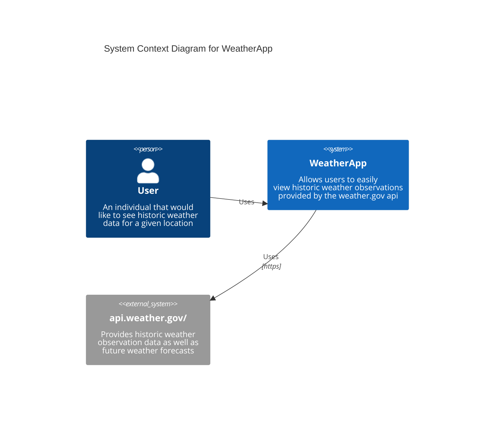
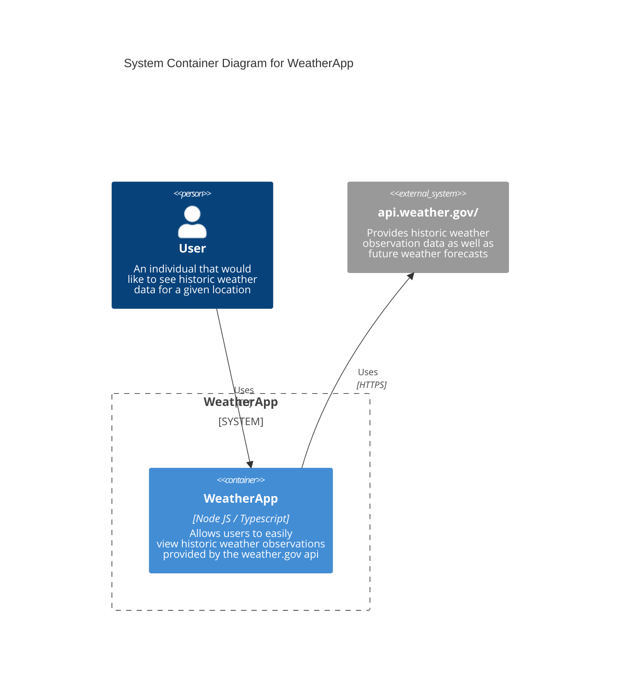
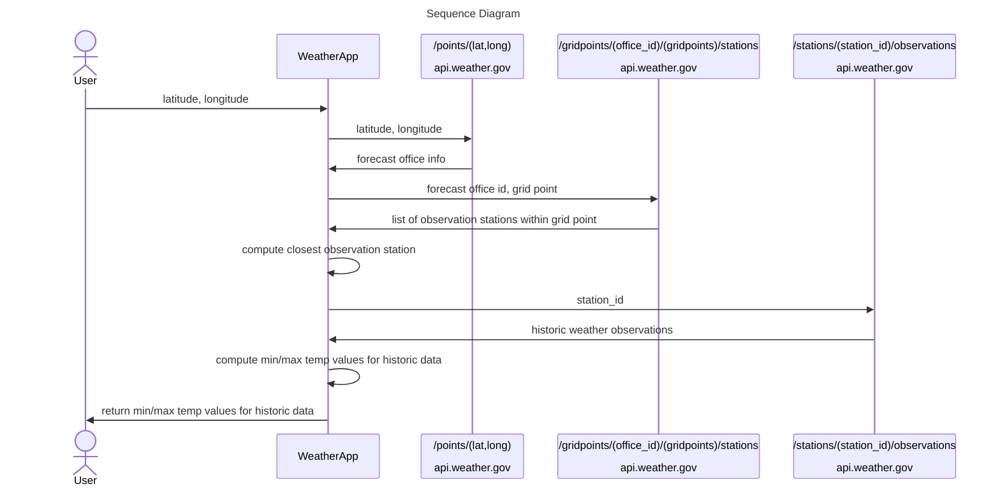
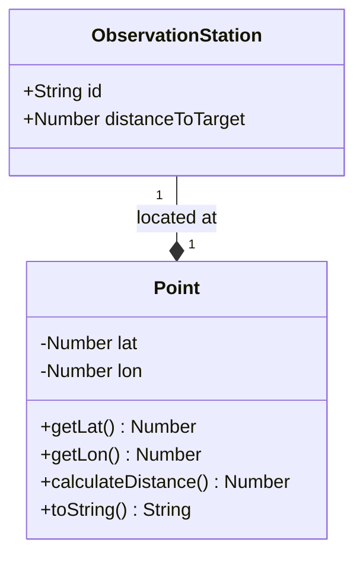

```mermaid

C4Context
    
    title System Context Diagram for WeatherApp
    Person(user, "User", "An individual that would <br />like to see historic weather <br />data for a given location")
    System(weather_app, "WeatherApp","Allows users to easily <br />view historic weather observations <br />provided by the weather.gov api")
    System_Ext(NWSAPI, "api.weather.gov/", "Provides historic weather <br />observation data as well as <br />future weather forecasts")
    Rel(user, weather_app, "Uses")
    Rel(weather_app, NWSAPI, "Uses", "https")

```

```mermaid

C4Container
    
    title System Container Diagram for WeatherApp
    Person(user, "User", "An individual that would <br />like to see historic weather <br />data for a given location")
    System_Boundary(WeatherApp, "WeatherApp") {
        Container(weather_app, "WeatherApp","Node JS / Typescript", "Allows users to easily <br />view historic weather observations <br />provided by the weather.gov api")
    }
    
    System_Ext(NWSAPI, "api.weather.gov/", "Provides historic weather <br />observation data as well as <br />future weather forecasts")
    Rel(user, weather_app, "Uses", "CLI")
    Rel(weather_app, NWSAPI, "Uses", "HTTPS")

```

```mermaid
sequenceDiagram
    title Sequence Diagram 
    actor User
    participant w as WeatherApp
    participant p as /points/(lat,long)<br /><br />api.weather.gov
    participant s as /gridpoints/(office_id)/(gridpoints)/stations<br /><br />api.weather.gov
    participant o as /stations/(station_id)/observations<br /><br />api.weather.gov
    User ->> w: latitude, longitude
    w ->> p: latitude, longitude
    p ->> w: forecast office info
    w ->> s: forecast office id, grid point
    s ->> w: list of observation stations within grid point
    w ->> w: compute closest observation station
    w ->> o: station_id
    o ->> w: historic weather observations
    w ->> w: compute min/max temp values for historic data
    w ->> User: return min/max temp values for historic data
```

---
# Class Diagrams

```mermaid

classDiagram
class ObservationStation {
    +String id
    +Number distanceToTarget
}

class Point {
    -Number lat
    -Number lon
    +getLat() Number
    +getLon() Number
    +calculateDistance() Number
    +toString() String
}
ObservationStation "1" --* "1" Point: located at


```