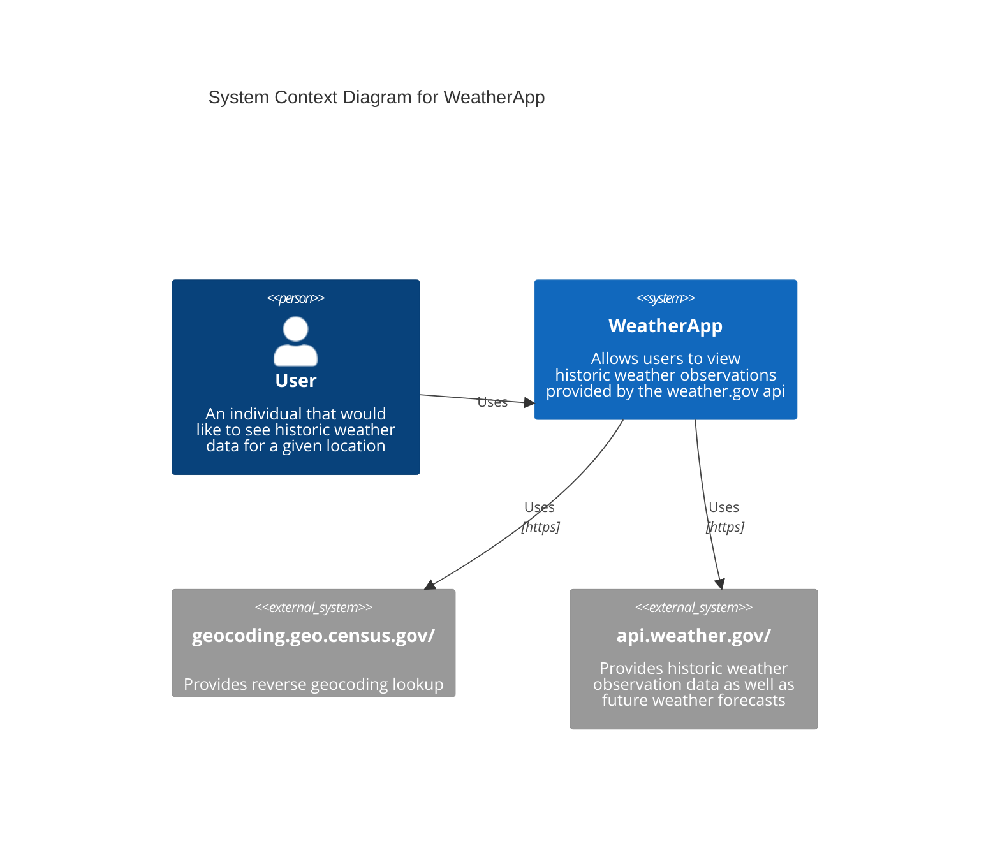
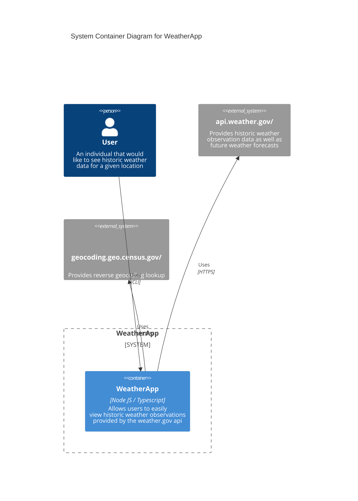
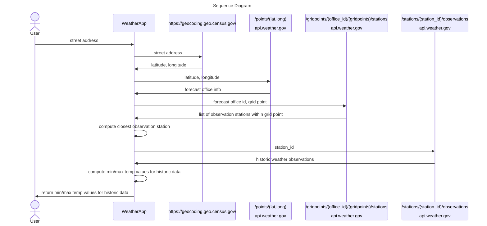

## Weather-App
A simple CLI tool for retrieving and displaying historic weather data for a supplied address.

## Setup
Clone the repo and then run:
  * <code>npm install</code> to install dependencies
  * <code>npm run build</code> to compile typescript files to javascript
  * <code>npm start</code> to start the application

### Usage
When the application starts, you will be prompted for an address in the following format:
  * street: (e.g. 1701 Bryant St)
  * city: (e.g. Denver)
  * state: (e.g. CO)
  * zipcode: (e.g. 80204)
 

The application will then use the census.gov api to convert the supplied address to a <code>latitude, logitude</code> coordinate pair 
which will be used to find the nearest observation station, from which the available historic weather data will be retrieved and 
displayed.

---

## Libraries Used:
* jest - for testing / mocking
* dotenv - for externalizing configuration parameters
* dotenv-expand - for interpolating environment variables in the .env file
* readline-sync - to simplify receiving user input

## Enhancements / Missing Functionality
* The https://api.weather.gov/ doesn't provide geocoding capabilitites, so the user is required to supply a street address which is then converted to a <code>latitude, longitude</code> tuple by the <code>census.gov</code> api.  As a result, the user must supply a valid street address, not just a city or zipcode (for a more detailed explanation of required inputs of the NWS api, see: https://weather-gov.github.io/api/general-faqs).  
* Input / output validation: currently there is limited input validation and little validation done on the returned payloads from the api's used.  A contract testing tool like pact (https://pact.io/) would ensure that api responses comform to expectations.
* Currently the application has only a CLI interface.  The application is written in such a way that the input and output logic are, for the most part, decoupled from the business logic (currently the display of the historic weather data is generated in the service that does the computation - this can/should be moved into a sepparate class to facilitate supporting additional consumers such as web and mobile as well as batch / stream consumers in the case of data pipelines / analytics), allowing for the core application to be re-used in other environments (e.g. fronted by a REST API for a webapp / analytics data source)
    * The architecture design of the system also takes testing into consideration: the interactions with external systems (user input via CLI and REST API calls) are done in separate components from where the business logic happens, allowing for a more extensible and testable code base.
* Mathematical precision: given that the data source is for observations in the United States, the distance calculations for all the observation station within a grid are quite accurate (the furthest possible distance being calculated between two points is no more than the diagnal between opposite vertices of a 2.k5m x 2.5km quadralateral --- an extreme edge case calculating the distance between oposite points on the globe yielded less than 70m  delta from the expected value)
* API error handling: currently the app only handles success (ok / 200), not found (404), and internal server error (500).  If the server returns a status code of 500, the application will wait 5 seconds (the timeout specified in the api.weather.gov docs for rate limiting -- all other errors are unspecified) and tries again once.  An enhancement would be to implement multiple retries (set in an external configuration ffle) with exponential back off (also set in an external configuration file).
